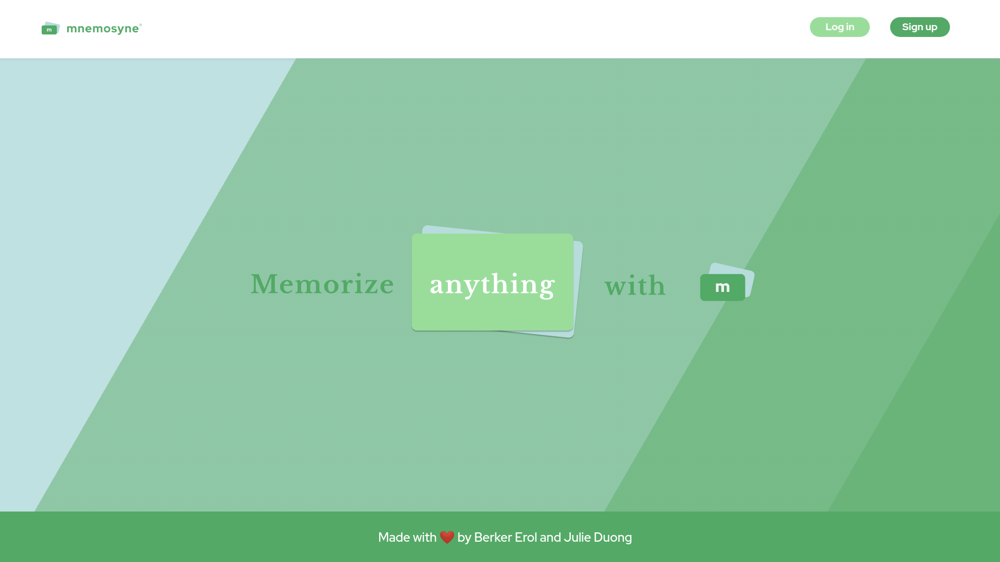
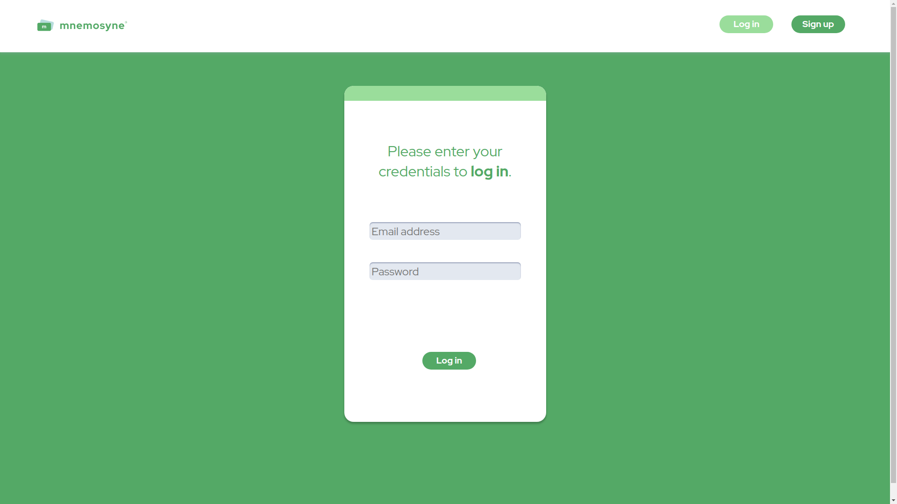
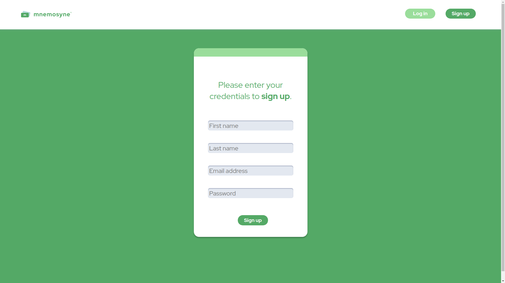
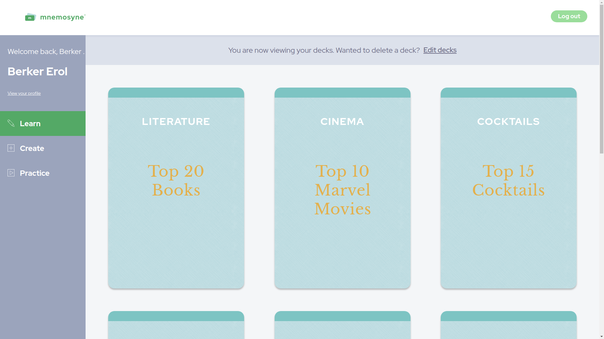
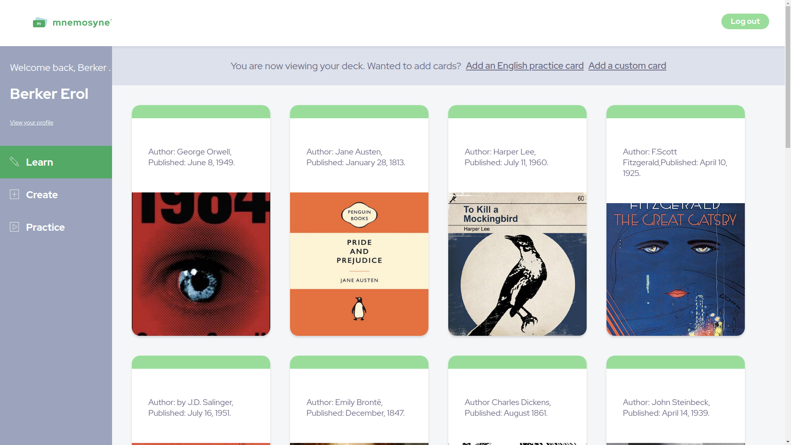
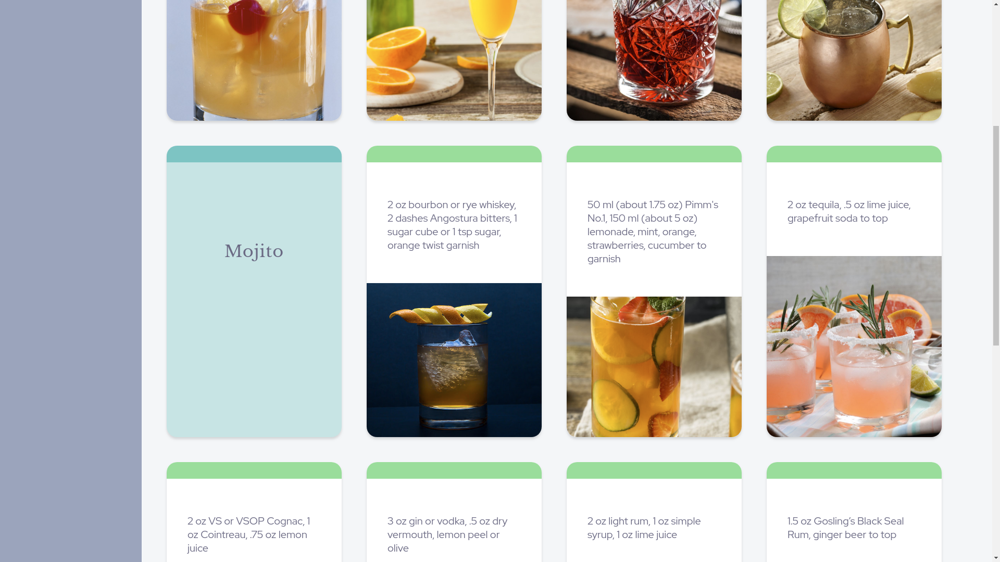
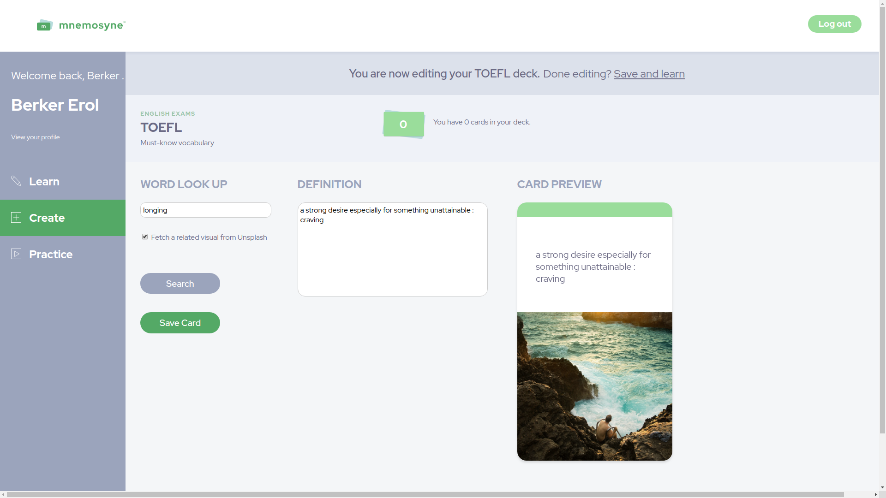
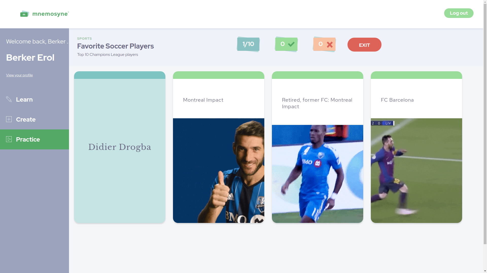

# Mnemosyne
Flash card application that lets a user learn and memorize any subject. The user can create custom cards with animated pictures, or create English cards where a dictionary definition and a related visual are fetched automatically. The user can then practice their decks in the game mode.

This is a final project done in the Lighthouse Labs Web Development Bootcamp by Berker Erol & Julie Duong.

Built with React (hooks), JavaScript, Knex, Express, Node.js, CSS3, HTML5, & Figma.

